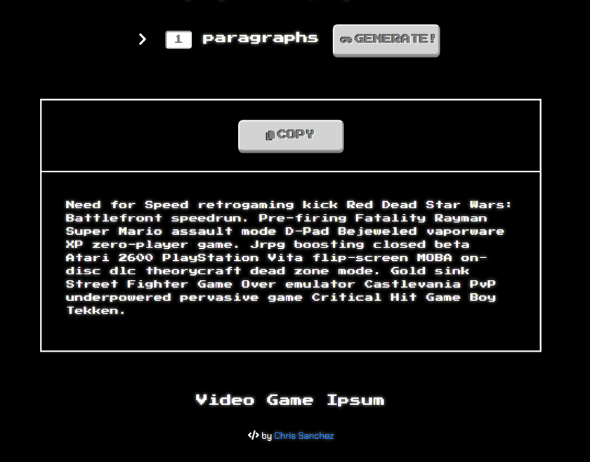

# [Video Game Ipsum](https://videogameipsum.netlify.app/)

### by Chris Sanchez

Need some placeholder text to display content with? Video Game Ipsum is a video game themed lorem ipsum generator built with React for video game, tech, or whatever themed website or copy you're working on!

## Technologies 

* JavaScript
* React.js
* Webpack / NPM
* [styled-components](https://github.com/styled-components/styled-components)
* [clipboard.js](https://clipboardjs.com/)

 - - -

## Available Scripts

In the project directory, you can run:

### `npm start` 

Runs the app in the development mode. 
Open [http://localhost:3000](http://localhost:3000) to view it in the browser.

The page will reload if you make edits. 
You will also see any lint errors in the console.

### `npm test` 

Launches the test runner in the interactive watch mode. 
See the section about [running tests](https://facebook.github.io/create-react-app/docs/running-tests) for more information.

### `npm run build` 

Builds the app for production to the `build` folder. 
It correctly bundles React in production mode and optimizes the build for the best performance.

The build is minified and the filenames include the hashes. 
Your app is ready to be deployed!
