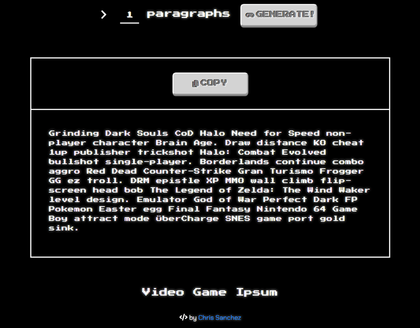

# [Video Game Ipsum](https://videogameipsum.netlify.app/)

## By Chris Sanchez

Need some placeholder text to display content with? Video Game Ipsum is a video game themed lorem ipsum generator built with React for video game, tech, or whatever themed website or copy you're working on!

## Technologies 

* JavaScript
* React.js
* Webpack / NPM
* [styled-components](https://github.com/styled-components/styled-components)
* [clipboard.js](https://clipboardjs.com/)
* Agile / KANBAN workflow

 - - -

## Available Scripts

In the project directory, you can run:

### `npm start` 

Runs the app in the development mode. 
Open [http://localhost:3000](http://localhost:3000) to view it in the browser.

The page will reload if you make edits. 
You will also see any lint errors in the console.

### `npm test` 

Launches the test runner in the interactive watch mode. 
See the section about [running tests](https://facebook.github.io/create-react-app/docs/running-tests) for more information.

### `npm run build` 

Builds the app for production to the `build` folder. 
It correctly bundles React in production mode and optimizes the build for the best performance.

The build is minified and the filenames include the hashes. 
Your app is ready to be deployed!

 - - -

### Support and Contact

If you run into any issues running **[Video Game Ipsum](https://videogameipsum.netlify.app/)**, please contact **Chris Sanchez**.

### License

Permission is hereby granted, free of charge, to any person obtaining a copy of this software and associated documentation files (the "Software"), to deal in the Software without restriction, including without limitation the rights to use, copy, modify, merge, publish, distribute, sublicense, and/or sell copies of the Software, and to permit persons to whom the Software is furnished to do so, subject to the following conditions:

The above copyright notice and this permission notice shall be included in all copies or substantial portions of the Software.

THE SOFTWARE IS PROVIDED "AS IS", WITHOUT WARRANTY OF ANY KIND, EXPRESS OR IMPLIED, INCLUDING BUT NOT LIMITED TO THE WARRANTIES OF MERCHANTABILITY, FITNESS FOR A PARTICULAR PURPOSE AND NON-INFRINGEMENT. IN NO EVENT SHALL THE AUTHORS OR COPYRIGHT HOLDERS BE LIABLE FOR ANY CLAIM, DAMAGES OR OTHER LIABILITY, WHETHER IN AN ACTION OF CONTRACT, TORT OR OTHERWISE, ARISING FROM, OUT OF OR IN CONNECTION WITH THE SOFTWARE OR THE USE OR OTHER DEALINGS IN THE SOFTWARE.

Copyright (c) 2020 **Chris Sanchez**
